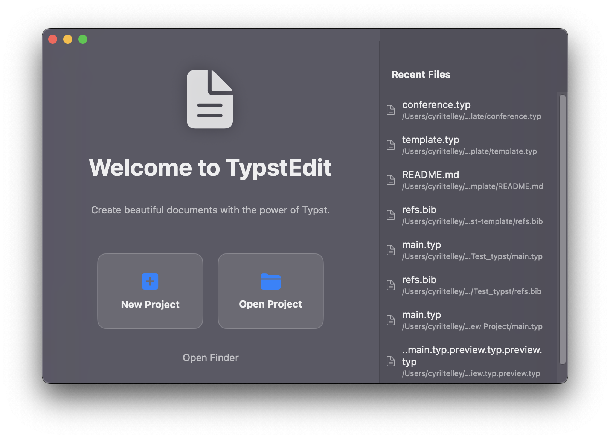

# TypstEdit

A native macOS editor for Typst, with Chinese and English UI, source editing and PDF preview.



## Build and run

Requires **macOS 13+** and **Swift 6.1+** (Command Line Tools or Xcode). No package dependencies need downloading.

```bash
swift build
./bundle.sh
open .build/TypstEdit.app
```

`bundle.sh` produces an optimized Release app for the current architecture and bundles the matching Typst executable. The generated app is ad-hoc signed for local use. The original tracked `TypstEdit.app` in this repository is an older prebuilt artifact; use `.build/TypstEdit.app` to run these changes.

For ARM64 + Intel:

```bash
./bundle_universal.sh
./create_dmg.sh
```

Generated apps and installers go in `.build/`. Build scripts accept Swift build options, for example `./bundle.sh --scratch-path /tmp/typstedit-build`.

## Compiler selection / 选择 Typst 版本

Open **TypstEdit → Settings…** (`⌘,`). Choose:

- **Automatic / 自动检测**: searches the inherited PATH and common Homebrew/Cargo locations first, then falls back to the bundled compiler.
- **Bundled / 内置版本**: uses the app's compiler (currently **0.12.0**).
- **Custom / 自选可执行文件**: select an executable or enter its absolute path; `~` and paths with spaces are supported. An invalid custom choice reports an error instead of silently using another version.

Settings display the selected path and the actual `typst --version` result. No compiler is downloaded automatically.

## Imports / 跨文件夹引用

The opened project folder is passed to Typst as `--root`. You can select another project root in Settings. The root must contain the current source file and any imported files.

```text
project/
  chapters/main.typ
  shared/style.typ
```

Open `project`, then either of these works inside `chapters/main.typ`:

```typst
#import "../shared/style.typ": *
#import "/shared/style.typ": *
```

Relative paths resolve beside each source file. Typst's `/shared/style.typ` is **project-root-relative**. It is not ordinarily the macOS filesystem path. For imports across folders, choose their common parent as the root. An explicit `/` root permits filesystem-absolute imports, but a smaller common project root is usually easier to keep portable. See [Typst path documentation](https://typst.app/docs/reference/syntax/).

Live preview uses a unique temporary `.typ` sibling so it can compile unsaved edits while preserving relative imports. The source directory must be writable. Preview PDFs live in the temporary directory and normal close/switch operations remove preview artifacts.

## Save, export and share

- **Open / 打开**: `⌘O`.
- **Save source / 保存源文件**: `⌘S`.
- **Export PDF / 导出 PDF**: `⇧⌘E`, or the export toolbar button. Select a destination; the editor compiles the captured current text, including unsaved changes. Compilation failure preserves an existing destination PDF.
- **Refresh Preview / 刷新预览**: `⇧⌘R`.
- Print uses the current successful preview. Sharing uses the last explicitly exported PDF.

Preview updates no longer overwrite a final PDF automatically. File switches, project changes, window close and app quit prompt for unsaved changes. Chinese/English UI follows the first macOS preferred language. The bilingual template uses `PingFang SC` with a Latin font fallback; PDF fonts/language remain under control of the Typst document.

## Performance and memory

The app and bundled CLI run natively on Apple Silicon. Typst uses its default available-CPU parallelism; the editor keeps one watcher per open document to retain incremental caches and observe imports. Typst compilation in this integration has no GPU or Neural Engine backend.

Syntax regexes are cached and evaluated serially off the main thread after a short debounce, with cancellation of obsolete work. Line offsets update around UTF-16 edits instead of rescanning the source. Only the current visible syntax colors and line labels are retained; the gutter belongs to the editor's native scroll view. PDF reload requests are coalesced and snapshots read in the background; PDFKit installation preserves position and zoom.

**Lower idle memory / 降低空闲内存占用** in Settings switches to a compiler process that exits after each edit-triggered compilation. This releases the compiler's cache while idle, at the cost of slower repeated builds. Imported files edited externally need **Refresh Preview** in this mode. The default incremental mode watches them automatically.

**Font discovery / 字体扫描** under Performance lets you add font folders (one absolute path per line) and optionally stop scanning system fonts. This can shorten cold compiler startup. Keep all fonts needed by your document available, including Chinese and emoji; embedded Typst fonts remain enabled. The default keeps system fonts. Replacement preview processes wait for old processes to exit, reducing overlapping caches.

Line-offset suffix shifts still scale with line count, PDF snapshots still take memory, and sustained profiling is needed. See [DIAGNOSTICS.md](DIAGNOSTICS.md) for measured results and limits.

## Regression checks

```bash
./test.sh
./benchmark.sh  # optional: repeatable line-index and tokenization A/B benchmarks
```

The native regression runner uses `swiftc`, AppKit and PDFKit, so it works with Command Line Tools without XCTest or full Xcode. It covers executable resolution, streamed diagnostics, UTF-16 positions, logical line offsets, Chinese IME composition, real imports and PDF export, compiler failure recovery, process/artifact cleanup, low-memory compilation, 3,000 randomized native storage edits, obsolete-task cancellation, PDF coalescing/retry, font configuration and rapid preview requests. macOS filesystem watcher tests need native file-event services; restrictive shell sandboxes may suppress these events.

## 📄 License

This project is open source. 

MIT License

Copyright (c) 2024 SuperMegaFort

Permission is hereby granted, free of charge, to any person obtaining a copy
of this software and associated documentation files (the "Software"), to deal
in the Software without restriction, including without limitation the rights
to use, copy, modify, merge, publish, distribute, sublicense, and/or sell
copies of the Software, and to permit persons to whom the Software is
furnished to do so, subject to the following conditions:

The above copyright notice and this permission notice shall be included in all
copies or substantial portions of the Software.

THE SOFTWARE IS PROVIDED "AS IS", WITHOUT WARRANTY OF ANY KIND, EXPRESS OR
IMPLIED, INCLUDING BUT NOT LIMITED TO THE WARRANTIES OF MERCHANTABILITY,
FITNESS FOR A PARTICULAR PURPOSE AND NONINFRINGEMENT. IN NO EVENT SHALL THE
AUTHORS OR COPYRIGHT HOLDERS BE LIABLE FOR ANY CLAIM, DAMAGES OR OTHER
LIABILITY, WHETHER IN AN ACTION OF CONTRACT, TORT OR OTHERWISE, ARISING FROM,
OUT OF OR IN CONNECTION WITH THE SOFTWARE OR THE USE OR OTHER DEALINGS IN THE
SOFTWARE.

## ❤️ Credits

* Built for [Typst](https://typst.app).
* Uses the official Typst CLI binary.
